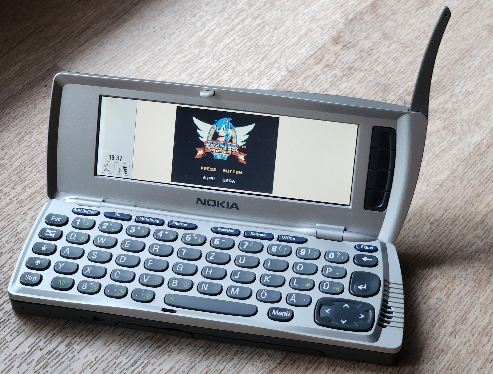
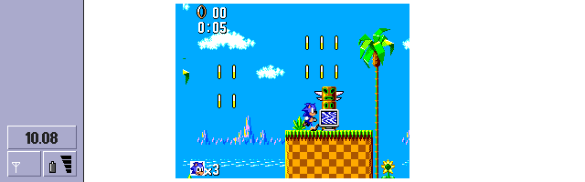

# E32SMS for Nokia 9210i

  

A hardware-validated, AI-assisted port of **SMS Plus 1.3** by Charles MacDonald
to the **Nokia 9210/9210i Communicator**.

## Current status

E32SMS boots and runs Sonic the Hedgehog on original Nokia 9210i hardware.

The current experimental build reaches approximately **27.0 emulated fps**
and **13.5 rendered fps** with `frameskip = 1`.

Keyboard input is now functional: directions, two action buttons and Pause are
mapped to the Nokia 9210i keyboard, and the first level of Sonic the Hedgehog
has been completed on original hardware. The build is playable, but it still
runs at roughly 45% of the Master System's intended real-time pace.

The latest title-screen measurement reached approximately **27.0 emulated fps**
and **13.5 rendered fps** with `frameskip = 1`. In a separate busy gameplay
scene, the new per-scanline sprite table reduced sprite-rendering time from
approximately **8.8 ms to 3.8 ms** per rendered frame. These scene-specific
measurements should not be treated as a single overall-fps comparison.

Current milestones:

- SMS Plus core running on Symbian OS 6.0 / EKA1;
- two-binary architecture: emulator EXE plus launcher APP;
- direct RGB444 output to the Nokia 9210i framebuffer;
- focus-gated VRAM access;
- hardware profiling and measured rendering optimizations;
- no game ROMs or copyrighted game data included.
- first ARM assembly blitter integrated and validated on original hardware;
- first ARM assembly framebuffer blitter integrated and validated on hardware;
- functional Nokia keyboard input for directions, two buttons and Pause;
- first Sonic level completed manually on original Nokia 9210i hardware;
- per-scanline sprite visibility table, reducing sprite rendering from ~8.8 ms
  to ~3.8 ms in the measured gameplay scene.

## Target platform

- Nokia 9210/9210i Communicator
- Symbian OS 6.0
- Series 80
- ARM920T / EKA1
- 640×200 Color4K display

## Development model

This is an **AI-assisted engineering project**.

Project direction, experiment design, legacy-toolchain builds, hardware testing,
log collection and result validation are performed by the maintainer on an
original Nokia 9210i. AI tools assist with source analysis, code generation,
debugging and documentation.

Changes are accepted as project results only after they have been built and
tested on real hardware.

## Development journal

An ongoing bilingual development journal documenting the port from the first
crashes to measurable performance on original hardware.

### English

1. [Hardcore vibe coding on a Nokia 9210i](docs/en/devlog/01-hardcore-vibe-coding.md)
2. [Booting is not playing](docs/en/devlog/02-booting-is-not-playing.md)
3. [The framebuffer war](docs/en/devlog/03-framebuffer-war.md)
4. [Open-heart surgery](docs/en/devlog/04-open-heart-surgery.md)
5. [Chasing frames](docs/en/devlog/05-chasing-frames.md)
6. [From slideshow to motion](docs/en/devlog/06-from-slideshow-to-motion.md)
7. [The first ARM assembly blitter](docs/en/devlog/07-first-arm-assembly.md)
8. [The first playable build](docs/en/devlog/08-first-playable-build.md)
9. [The last cheap win](docs/en/devlog/09-last-cheap-win.md)

### Русский

1. [Хардкорный вайбкодинг на Nokia 9210i](docs/ru/devlog/01-hardcore-vibecoding.md)
2. [Запускается — не значит играет](docs/ru/devlog/02-boots-is-not-plays.md)
3. [Война за framebuffer](docs/ru/devlog/03-framebuffer-war.md)
4. [Операция на открытом сердце](docs/ru/devlog/04-open-heart-surgery.md)
5. [В погоне за кадрами](docs/ru/devlog/05-chasing-frames.md)
6. [Из слайд-шоу — в движение](docs/ru/devlog/06-from-slideshow-to-motion.md)
7. [Первый ARM-ассемблерный блиттер](docs/ru/devlog/07-first-arm-assembly.md)
8. [Первая играбельная сборка](docs/ru/devlog/08-first-playable-build.md)
9. [Последний дешёвый выигрыш](docs/ru/devlog/09-last-cheap-win.md)

## Engineering notes

- [ARM assembly remap-to-VRAM blitter](docs/en/engineering/arm-assembly-blitter.md)
- [Nokia 9210i keyboard input](docs/en/engineering/keyboard-input.md)
- [Per-scanline sprite visibility table](docs/en/engineering/sprite-line-table.md)
- [ARM-ассемблерный блиттер преобразования и вывода в VRAM](docs/ru/engineering/arm-assembly-blitter.md)
- [Управление с клавиатуры Nokia 9210i](docs/ru/engineering/keyboard-input.md)
- [Построчная таблица видимости спрайтов](docs/ru/engineering/sprite-line-table.md)

## Repository status

This is a public research and preservation repository under active development.

Expect incomplete features, experimental code and a build process tied to a
historical Symbian toolchain. Issues, source references and hardware-test
results are welcome.

No game ROMs, proprietary SDK files or copyrighted game data are distributed
with this project.

## Licensing status

The current E32SMS source tree does not yet have a single unified license.

Most SMS Plus-derived code and the original E32SMS additions are intended to be
distributed under `GPL-2.0-or-later`. However, the current tree also contains a
legacy Z80 CPU core subject to separate non-commercial terms, as well as a small
amount of material with unresolved MAME provenance.

The repository is therefore published as a development, research and
license-audit snapshot. Its availability on GitHub does not grant rights beyond
the licenses and notices attached to the individual components, and the tree
should not yet be treated as a legally cleared unified GPL release.

See [LICENSE.md](LICENSE.md) and
[THIRD_PARTY_NOTICES.md](THIRD_PARTY_NOTICES.md) for details.
